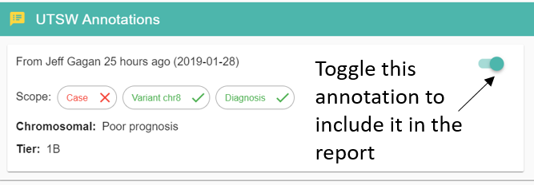

.. _faq:

FAQ
===

Here are some tutorials on how to perform common tasks in Answer:

Assign a case to a pathologist
------------------------------

To work on a case, a user needs to have annotation permissions and the case needs to be assigned to her.

#. go to the homepage and find the case you want to assign (use the Quick Filter button if needed) in the **My Cases** or the **All Cases** table.
#. click on |assign| 
#. toggle the button next to all the pathologists who need to work on the case.
#. click **SAVE**.
#. all new pathologists assigned to a case will receive an email informing them that a case is ready.

.. image:: img/homepage/assign-case.png 
   :width: 600   

Filter variants
------------------

From the homepage, open a case by clicking on |pencil| or |eye| depending if you can edit or just view (respectively) a case.
If you are assigned to a case, you can also click on **Open Case >** and select a case from the list.

Scroll down to the SNP/INDEL table and click on either the Advanced Filtering button |filter| or use the menu and click **Advanced Filtering**.

The **Filters** bar on the left of the screen enables the filtering of a large set of variant properties. 
The content of this panel will match the type of variant you are browsing. Click on the **CNV** tab and see the list of filters available change. Click back on **SNP/INDEL**
SNPs and CNVs have their own set of filters while Fusion does not.

Each row in the **Filters** bar refers to a column in the table, usually with the same name. Some filters can be working on the same column. 
For instance the **Flags** column contains multiple values that can be filtered with the **Flags** **Pass QC/Fail QC** and **Annotated/Not Annotated**.

If you have used online shopping websites, the functionalities are fairly similar.

Let's create a filter by toggling **Pass QC** and **gnomAD Pop. Max. Allele %** Max value at 1%.

If you scroll up, you can see the two filters listed and the refresh button |refresh| turned orange to indicate that a refresh is needed.

Click refresh |refresh| to only keep rows that passed QC and have a gnomAD Pop. Max. Allele % lower than 1%.

Now you might want to focus on a specific list of genes:

- you can type the genes in the **Gene Name(s)** field
- or use a predefined gene set

.. image:: img/opencase/advanced_filtering_gene_sets.png 
   :width: 600

Let's select ACMG SF v2.0.

You can also create your own gene sets in the :ref:`annotations` page.

Don't forget to click the refresh |refresh| button to see the results. It's possible that no variant matches the 3 filters currently applied.
Adjust the filters (for instance remove **Pass QC**) by either toggling the button again or removing the filter from the list at the top. Click refresh |refresh|.

Keep playing with filters until you get a satisfying result.

After all these efforts, it would be nice to save your filter set for later use. Click on **Edit/Save Current Filter Set** |save|.

Enter a name for your filter set and click **CREATE**.

Now you can load your saved filters by clicking on the **Load Filter Set** button |loadfilter|.   

To clear the current filters click on the **Clear Filters** button |clearfilters|.

.. |clearfilters| image:: img/filter-remove-outline.png 
   :width: 20    

Create an annotation
--------------------

To create an annotation, open a case (you need to have **Annote** permission on your account see :ref:`preferences`).

Click on a variant |zoom| to open it.

.. |zoom| image:: img/baseline_zoom_in_black_18dp.png 
   :width: 20    

More detailed description of annotations :ref:`here <opencase_create>`

.. _createreport:

Create a report
---------------

A report combines all selected variants and annotations for a case.

You need to select each variant and toggle each annotation card that you want in the report.

For each variant, the annotations are combined and the highest tier determine the location of the annotation in the report.

To see which variants are currently selected, go to **Review Variants Selected**.

You can see the details for each selected variant by clickling on the **Variant Details** button |zoom|.

Once all annotations and variants have been selected click on **READY FOR REPORT** to make the case available for reporting.

You can directly access the report by clicking on |clipboard| in the popup at the bottom of the page.

See detailed description of the **Open Report** page :ref:`here <openreport>`.

Each table in the report gets populated by selected annotations based on their category and tier.

You can edit the text part of each annotation independently of the actual annotation card by clicking on the |pencil|. 
The modications made on this page will only be reflected in the final report and won't affect the content of any annotation card. 

If you want to make modifications to the variant selection or edit the actual annotations,
go back to the case by clicking on **Open Case** in the top left menu. 

You can go back to the report from the **Open Case** page in a similar fashion.

All available trials (from UTSW annotations and MD Anderson's) are preselected. You might want to unselect the ones that are not relevant.

The **NEW REPORT** button fetches the latest annotations and selected variants and creates a new report.

The **Report Notes** will be displayed at the top of the PDF as the case summary.

Click on the **Preview Report as PDF** button |pdf| to preview the results.

As long as the report is not finalized, a DRAFT watermark will be visible on each page of the PDF.

To save your report with the modified annotations, click on the **Save Report** button |save|. You can enter a personalized named or leave it as default. 
The name you pick for the report will not be displayed in the final PDF. It is only used for users to find a specific report when multiple versions are saved.

Once a report is saved, you can reload it and mark it has finalized which will freeze all modifications and move the case to its final stage. Users in charge of handling the PDF will receive
a notification that a report is ready.

You can create as many reports as needed but we recommend to only finalize one report.

