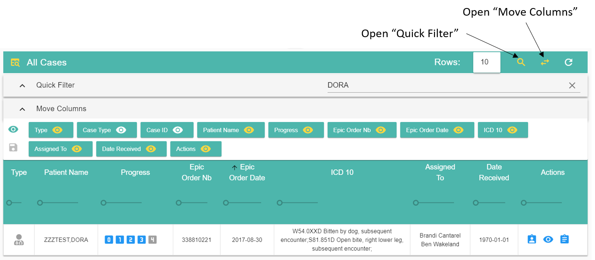

Using Answer
============

Most pages in answer share similar features like menus and tables.
Once you are familiar on how to use those, it should be fairly easy to understand most features in Answer.

All pages have a title bar at the top, a navigation menu on the left (to go to another page) and the content of the page under the title bar.

The left side of the title bar can have a menu with functions such as showing/hiding panels, saving your work or opening external tools. 
Click to open it and see all the functions available.

The right side of the title bar can have shortcuts to functions you want to use most often. Hover each button with the mouse to reveal what it can do.

Navigation Bar
--------------

You can access the main sections of Answer via the nabigation bar on the left.

|homeIcon| **Home**: navigate to the homepage. More info :ref:`here <homepage>`. 

**Open Case >** : open and work on a case you are assigned to.
Only your cases are listed.
More info :ref:`here <opencase>`. 

**Open Report >** : open and work on reports you are assigned to.
Only cases ready for reports are listed.
More info :ref:`here <openreport>`. 

|annotations| **Annotations**: create annotations and trials outside of a case. More info :ref:`here <annotations>`. 

|adminIcon| **Admin**: for administrators only. Manage users and other website settings. More info :ref:`here <admin>`. 

|preferencesIcon| **Preferences**: show the permissions on your account and edit your preferences 
such as column orders for tables. More info :ref:`here <preferences>`. 

|help| **Help**: open this page

|logout| **Logout**: close your session. 
You will have to log in again. 
Your session expires automatically after 30 min of inactivity.

Sub-pages
---------

Sometimes a page will have multiple layers on top of each other as you explore variants 
(for instance when going from a case to a variant then to its annotations).

An easy way to tell if you are in a layer is if the navigation menu is hidden
and the page content takes all the space available.
There is a close button in the title bar to go back to the previous layer.
There are also beadcrumbs at the top of the page to help you navigate the layers and to know where you are.

Tables
------

Most data tables share the same features. Some tables have extra options described in their own section.

A yellow button indicates that the function is currently active (or the panel/menu it opens is visible). Click on the button again to deactivate the function or hide the panel/menu.

The **Quick filter** bar can search for any term in the table, even in hidden columns. Only rows containing the search string will be displayed.

The **Move Column** bar can reorder columns (drag and drop with the mouse) as well as show or hide a column. You can also change the width of each column by moving the ruler under each column header (experimental).
You can save the current layout of the table by clicking the save button located on the left of the bar.

Most columns can be sorted (no nested sort though) by clicking on the column header.

**Rows: 10** indicates the number of rows visible. You can change the number to display more rows but large numbers (100+) might slow down the interface.

In most situations you can display a button's functionality by hovering it with the mouse.

.. |homeIcon| image:: img/baseline_home_black_18dp.png 
   :width: 20

.. |adminIcon| image:: img/baseline_settings_black_18dp.png 
   :width: 20

.. |preferencesIcon| image:: img/baseline_account_circle_black_18dp.png 
   :width: 20

   