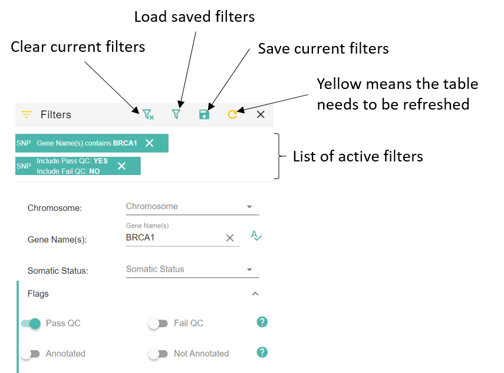
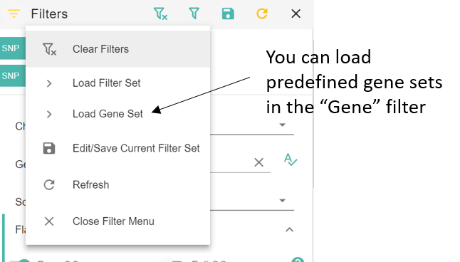

Open Case
============

The goal of this page is to select variants and create annotations going into the final report.

Any change on the page is saved every 2 minutes or by clicking the save button at the top right corner in the toolbar.

Patient Details
---------------

All cases need an **OncoTree Diagnosis** value. You can open Oncotree or OncoKB Genie Portal by using the two buttons next to the text field.

.. image:: img/oncotree.png
   :width: 400

Case Notes
----------

You can write any notes about the case that don't fit into a standard annotation.

Variant Tables (SNP/INDEL, CNV, FUSION / TRANSLOCATION)
-------------------------------------------------------

Click on each tab to display the corresponding variants.

.. image:: img/advanced_filtering_overview.png

