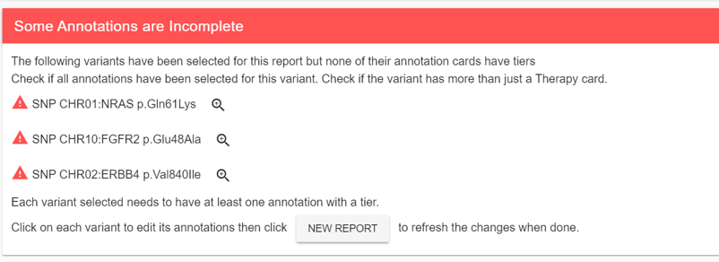
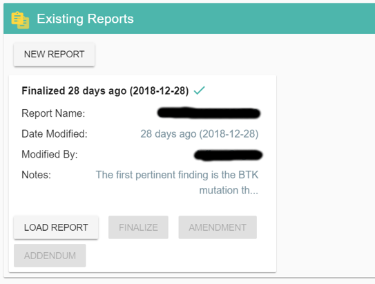

.. _openreport:

Open Report
===========

When a case is ready for report, it will be listed when opening the **Open Report** menu in the navigation bar.

A report is dynamically generated based on the latest variants and annotations selected for a case.

Some Annotations are Incomplete
-------------------------------

This panel will list variants that have been selected but don't have enough annotations.

Most often this warning indicates that some annotations don't have tiers or need more than a Therapy annotation card.
Click on the magnifying class to create missing annotations or modifying existing ones.
Once the changes are made, refresh the Report or click on **NEW REPORT** to make the warning disappear.
Until the warning is gone, the variants listed won't be part of the report.

Existing Reports
----------------

You can save your current work on a report by using the save button in the title bar. 
All saved reports will be listed in this panel and your can reload any previous report by clicking on it.

You can export a report to PDF as many times as you want until you are satisfied with the result.

PubMed References
-----------------

If there are any PubMed ids in the selected annotations, they will appear in this table with a format similar to a PubMed summary page.
You can click on a PubMed id to go directly to that article in PubMed.

More details on how to create a report :ref:`here <createreport>`.

